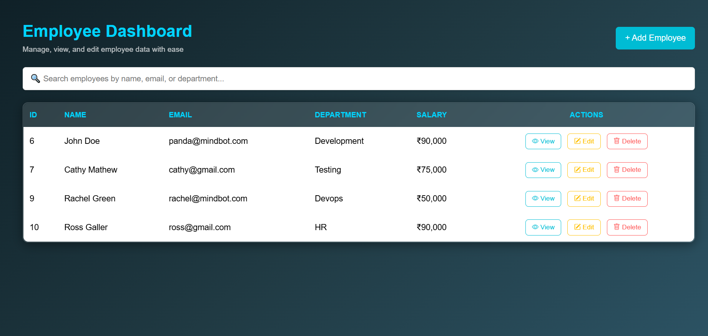
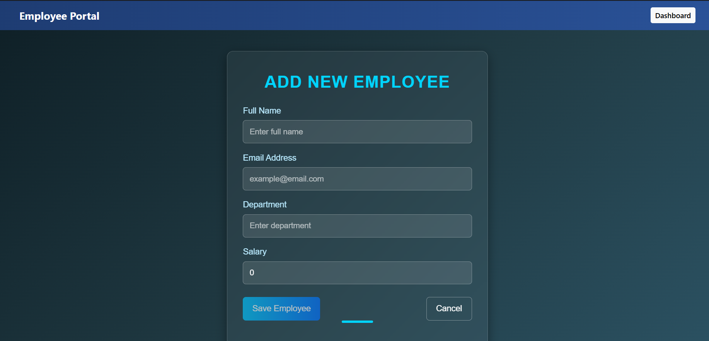
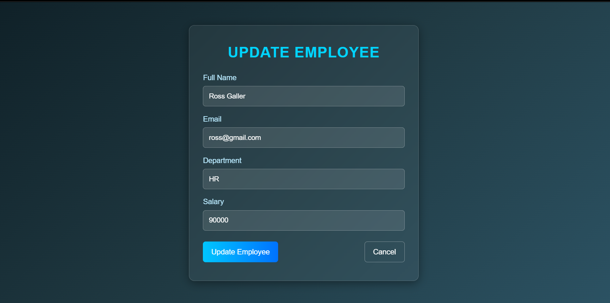
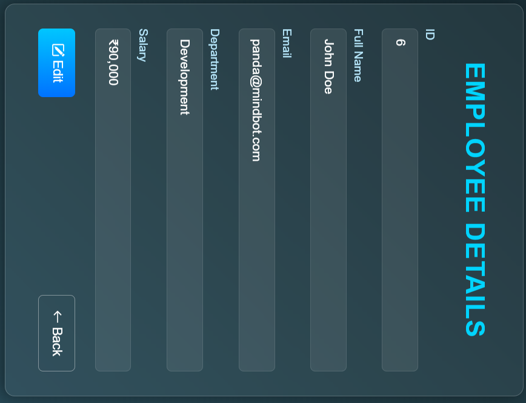

# 💼 Employee Management System (EMS)

### 🔹 Full-Stack Web Application using Spring Boot + Angular 20

A modern, responsive Employee Management System built using **Spring Boot (Java)** for the backend, **Angular 20** for the frontend, and **MySQL** as the database.  
This project allows performing full **CRUD operations** (Create, Read, Update, Delete) on employee data with a **clean glassmorphic UI** and a **RESTful architecture**.

---

## 🖥️ Demo Screenshots

| Page | Screenshot |
|------|-------------|
| Dashboard (Employee List) |  |
| Home Page |  |
| Add Employee |  |
| Update Employee |  |
| View Employee (with shimmer loader) |  |
---

## ⚙️ Tech Stack

### 🧠 Backend (Spring Boot)
- Java 17  
- Spring Boot 3+  
- Spring Data JPA  
- MySQL Database  
- REST API (JSON)  
- Maven  

### 🌐 Frontend (Angular 20)
- Angular 20 (Standalone Components)  
- TypeScript  
- RxJS & Reactive Forms  
- Bootstrap Icons  
- Responsive Glassmorphic UI  
- Shimmer Loading Animation  

### 🗄️ Database
- MySQL  
- Table: `employees`  
- Columns: `id`, `name`, `email`, `department`, `salary`  

---

## 🧩 Project Structure
Employee-Management-System/
│
├── EMS-backend/ # Spring Boot (Java)
│ ├── src/main/java/.../controller/EmployeeController.java
│ ├── src/main/java/.../service/EmployeeService.java
│ ├── src/main/java/.../repository/EmployeeRepository.java
│ ├── src/main/java/.../model/Employee.java
│ ├── src/main/resources/application.properties
│ └── pom.xml
│
├── EMS-frontend/ # Angular 20
│ ├── src/app/
│ │ ├── components/
│ │ │ ├── employee-list/
│ │ │ ├── add-employee/
│ │ │ ├── update-employee/
│ │ │ ├── view-employee/
│ │ ├── models/employee.ts
│ │ ├── services/employee.service.ts
│ │ ├── app.routes.ts
│ │ └── main.ts
│ ├── src/environments/environment.ts
│ └── angular.json
│
└── README.md

---

## 🚀 Setup & Installation

### 1️⃣ Clone the Repository
```bash
git clone https://github.com/your-username/employee-management-system.git
cd employee-management-system
2️⃣ Backend Setup (Spring Boot)

Navigate to backend folder:

cd EMS-backend

🧰 Configure Database in application.properties:
spring.datasource.url=jdbc:mysql://localhost:3306/ems
spring.datasource.username=root
spring.datasource.password=your_password
spring.jpa.hibernate.ddl-auto=update
spring.jpa.show-sql=true
server.port=8080

▶️ Run the Backend:
mvn spring-boot:run


Backend will start at 👉 http://localhost:8080

3️⃣ Frontend Setup (Angular 20)
cd ../EMS-frontend
npm install

🌐 Proxy Config

Create proxy.conf.json:

{
  "/api": {
    "target": "http://localhost:8080",
    "secure": false,
    "changeOrigin": true
  }
}


Add this in package.json scripts:

"start": "ng serve --proxy-config proxy.conf.json"

▶️ Run the Frontend:
npm start


Frontend will run on 👉 http://localhost:4200

🧠 API Endpoints

| Method | Endpoint              | Description         |
| ------ | --------------------- | ------------------- |
| GET    | `/api/employees`      | Get all employees   |
| GET    | `/api/employees/{id}` | Get employee by ID  |
| POST   | `/api/employees`      | Create new employee |
| PUT    | `/api/employees/{id}` | Update employee     |
| DELETE | `/api/employees/{id}` | Delete employee     |


🖋️ Features

✅ Add New Employee
✅ Edit Employee Details
✅ Delete Employee
✅ View Employee Details (with shimmer loader)
✅ Responsive Table View
✅ Glassmorphic UI
✅ Fully Integrated REST API
✅ Proxy Configuration for Angular
✅ Modular Folder Structure
✅ Reusable Service Layer

🪄 UI Highlights

✨ Gradient Background (#0f2027 → #2c5364)
🧊 Glassmorphic Cards (blur + border glow)
💡 Animated Shimmer Loader for smooth UX
💙 Teal Accent Color for consistency
📱 Fully Responsive Design

🔐 Future Enhancements

🔸 JWT Authentication + Spring Security

🔸 Toast Notifications (Success/Error)

🔸 Role-based Access (Admin/User)

🔸 Pagination and Sorting

🔸 Employee Photo Upload

🧑‍💻 Author

👤 Chaitali Kulkarni
💬 Developer | Java + Angular Enthusiast | Building Cool AI Tools

📧 Contact: kulkarnichaitali22@gmail.com

🐙 GitHub: https://github.com/kulkarnichaitali22

⭐ Contribute

If you like this project:

⭐ Star this repo


and feel free to:

Fork it

Add new features

Submit a Pull Request


“Built with ❤️ using Java Spring Boot, Angular 20, and MySQL — because clean code and design go hand in hand.”

